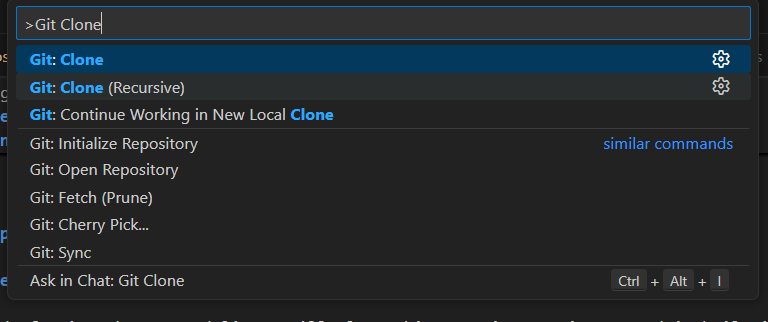
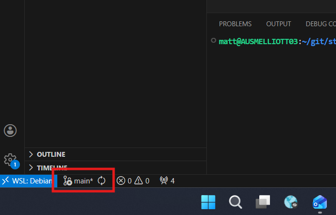
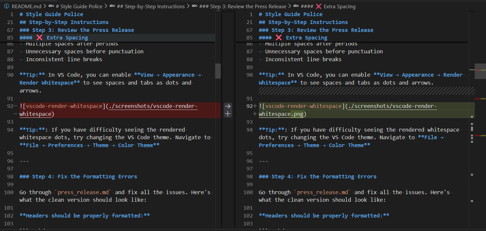
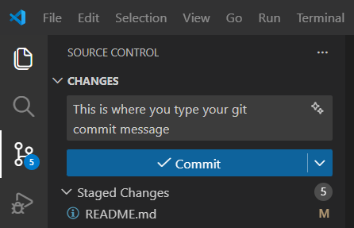

# Style Guide Police

## Exercise Goal

Learn to use VS Code's diff and staging features by fixing formatting errors. This exercise focuses on visual code review and leveraging VS Code's built-in Git tools instead of the command line.

**What you'll learn:**
- How to clone repositories using VS Code's GUI
- Using the Diff View to review changes before committing
- Staging and committing directly in VS Code
- The importance of code review in collaborative workflows

---

## Scenario

You've been asked to review and fix a press release that's full of formatting violations. Your job as the "Style Guide Police" is to clean it up before it goes live!

---

## Step-by-Step Instructions

### Step 1: Clone the Repository Using VS Code

Instead of using the command line, we'll clone this repository using VS Code's built-in features.

1. Open **VS Code**
2. Press `Ctrl+Shift+P` (Windows/Linux) or `Cmd+Shift+P` (Mac) to open the Command Palette
3. Type `Git: Clone` and select it from the list



4. Paste the repository URL when prompted:
   ```
   https://github.com/AMD-melliott/style-guide-police.git
   ```
5. Choose a location on your computer to save the project
6. When prompted "Would you like to open the cloned repository?", click **Open**

**Learn more:** [VS Code Docs: Cloning a repository](https://code.visualstudio.com/docs/sourcecontrol/intro-to-git#_clone-a-repository)

---

### Step 2: Create a New Branch

Let's create a branch for our fixes using VS Code.

**Option A: Using the Command Palette**
1. Press `Ctrl+Shift+P` / `Cmd+Shift+P`
2. Type `Git: Create Branch` and select it
3. Enter a branch name: `fix-formatting-errors`
4. Press Enter

**Option B: Using the Status Bar**
1. Look at the bottom-left corner of VS Code
2. Click on the branch name (it should say `main`)



3. Select **Create new branch** from the menu
4. Enter branch name: `fix-formatting-errors`

**Learn more:** [VS Code Docs: Working with branches](https://code.visualstudio.com/docs/sourcecontrol/overview#_branches-and-tags)

---

### Step 3: Review the Press Release

Open `press_release.md` in VS Code and review it carefully.

**What to Look For:**

#### ❌ Missing Headers
Markdown headers should use `#` symbols:
- `# Heading 1` for main title
- `## Heading 2` for sections
- `### Heading 3` for subsections

#### ❌ Double Spaces
Look for multiple spaces between words (they're hard to see, but they're there!)

#### ❌ Misspelled Product Names
The product is called **"Project Alpha"** (capital A), not "Project Alfa" or "Project alfa"

#### ❌ Extra Spacing
- Multiple spaces after periods
- Unnecessary spaces before punctuation
- Inconsistent line breaks

**Tip:** In VS Code, you can enable **View → Appearance → Render Whitespace** to see spaces and tabs as dots and arrows.


**Tip:**: If you have difficulty seeing the rendered whitespace dots, try changing the VS Code theme. Navigate to **File → Preferences → Theme → Color Theme**

---

### Step 4: Fix the Formatting Errors

Go through `press_release.md` and fix all the issues. Here's what the clean version should look like:

**Headers should be properly formatted:**

```markdown
# Press Release

## New Product Launch
```

**Product name should be consistent:**
- Change "Project Alfa" → "Project Alpha"
- Change "Project alfa" → "Project Alpha"

**Remove double spaces:**
- "New  Product" → "New Product"
- "Project Alfa  includes" → "Project Alpha includes"

**Section headers should use proper Markdown:**
```markdown
## Key Features

## About Project Alpha

## Contact Information
```

Don't rush! Take your time to catch all the errors.

---

### Step 5: Review Your Changes in the Diff View

This is where VS Code really shines! Let's visually review what you've changed.

1. Click on the **Source Control** icon in the left sidebar (it looks like a branch with circles)


2. You should see `press_release.md` listed under **Changes**
3. Click on `press_release.md` to open the **Diff View**



**What you're seeing:**
- **Left side:** Original version (what it was before)
- **Right side:** Your version (what you changed)
- **Red highlights:** Lines you removed or changed
- **Green highlights:** New or modified content

4. Review each change carefully:
   - Did you fix all the double spaces?
   - Are all instances of "Alfa" now "Alpha"?
   - Are headers properly formatted?

**Why this matters:** In real projects, reviewing your changes before committing helps catch mistakes and ensures you're only committing what you intended to change.

**Learn more:** [VS Code Docs: Reviewing changes](https://code.visualstudio.com/docs/sourcecontrol/overview#_viewing-diffs)

---

### Step 6: Stage Your Changes

"Staging" tells Git which changes you want to include in your next commit.

In the **Source Control** sidebar:

1. Hover over `press_release.md` in the Changes list
2. Click the **+** (plus) icon that appears
3. The file should move from **Changes** to **Staged Changes**

**Alternative:** Click the **+** icon next to "Changes" to stage all files at once.

**What happened?** Your changes are now "staged" and ready to commit. Think of this as packing items into a box before sealing it.

---

### Step 7: Commit Your Changes

Now let's create a commit with a clear message.

1. In the **Source Control** sidebar, look for the text box at the top (it says "Message")
2. Type a clear commit message:
   ```
   Fix formatting errors in press release

   - Correct product name from "Alfa" to "Alpha"
   - Add proper Markdown headers
   - Remove double spaces
   - Fix spacing inconsistencies
   ```



3. Click the **✓ Commit** button (or press `Ctrl+Enter` / `Cmd+Enter`)

**Tip:** Good commit messages explain **what** changed and **why**. The first line should be a short summary, followed by bullet points with details.

**Learn more:** [Conventional Commits](https://www.conventionalcommits.org/) - A standard for writing clear commit messages

---

### Step 8: Push Your Changes to GitHub

Now let's upload your branch to GitHub.

1. In the **Source Control** sidebar, click the **⋯** (three dots) menu
2. Select **Push**

**Alternative:** Look at the bottom-left status bar and click the **↑** (cloud upload) icon with a number next to it.

3. If this is your first push on this branch, VS Code may ask to "publish the branch" - click **OK**

**What happened?** Your `fix-formatting-errors` branch is now on GitHub!

---

### Step 9: Create a Pull Request

Now let's propose your changes for review.

1. In VS Code, look for a notification or message suggesting you create a pull request
   - Or open GitHub in your browser: `https://github.com/AMD-melliott/style-guide-police`

2. You should see a yellow banner with **Compare & pull request**
3. Click the button and create your PR with:
   - **Title:** "Fix formatting errors in press release"
   - **Description:**
     ```
     This PR fixes multiple formatting issues:
     - Corrected product name spelling (Alfa → Alpha)
     - Added proper Markdown headers
     - Removed double spaces
     - Fixed spacing inconsistencies
     ```

4. Click **Create pull request**

**Congratulations!** You've completed the Style Guide Police exercise! 🎉

---

## Key Takeaways

✅ **VS Code's Diff View** makes it easy to review changes visually
✅ **Source Control sidebar** provides a GUI alternative to command-line Git
✅ **Staging changes** gives you control over what goes into each commit
✅ **Clear commit messages** help collaborators understand your work
✅ **Pull requests** enable code review and discussion before merging

---

## Bonus Challenges

Want to practice more? Try these:

### Challenge 1: Use the Timeline View
- Right-click on `press_release.md` in the Explorer
- Select **Open Timeline**
- See the complete history of changes to this file

**Learn more:** [VS Code Docs: Timeline View](https://code.visualstudio.com/docs/sourcecontrol/overview#_timeline-view)

### Challenge 2: Undo a Change
- Make an intentional mistake in the file
- In the Source Control sidebar, right-click the file
- Select **Discard Changes** to undo your edits

### Challenge 3: Review Someone Else's PR
- Go to the [Pull Requests tab](https://github.com/AMD-melliott/style-guide-police/pulls)
- Review a classmate's PR
- Leave a comment or suggestion

---

## Troubleshooting

### "I can't see the Source Control icon"
- Press `Ctrl+Shift+G` (Windows/Linux) or `Cmd+Shift+G` (Mac) to open Source Control
- Or go to **View → Source Control** from the menu

### "The Diff View isn't showing"
- Make sure you clicked on the filename in Source Control (not the + icon)
- If it still doesn't work, try right-clicking the file and selecting **Open Changes**

### "I committed to main instead of a branch"
- Don't worry! You can move your commit to a new branch:
  - Command Palette → `Git: Create Branch`
  - VS Code will ask if you want to move uncommitted changes

---

## Additional Resources

- [VS Code Git Integration Overview](https://code.visualstudio.com/docs/sourcecontrol/overview)
- [VS Code Tips: Source Control](https://code.visualstudio.com/docs/getstarted/tips-and-tricks#_source-control)
- [Markdown Guide](https://www.markdownguide.org/basic-syntax/)
- [Git Best Practices](https://www.git-scm.com/book/en/v2/Distributed-Git-Contributing-to-a-Project)

---

**Next Exercise:** [Merge Conflict Simulator](https://github.com/AMD-melliott/merge-conflict-simulator) - Learn to resolve conflicts when changes collide!
